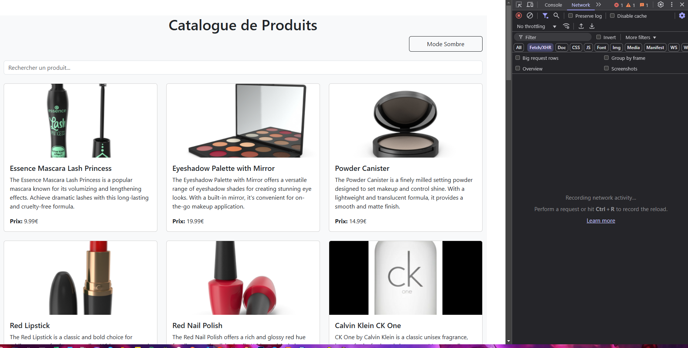
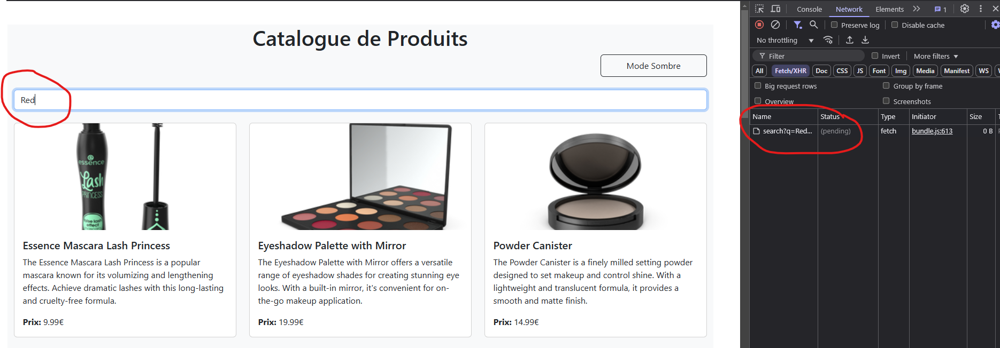
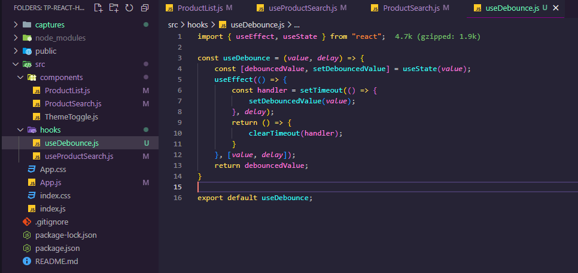
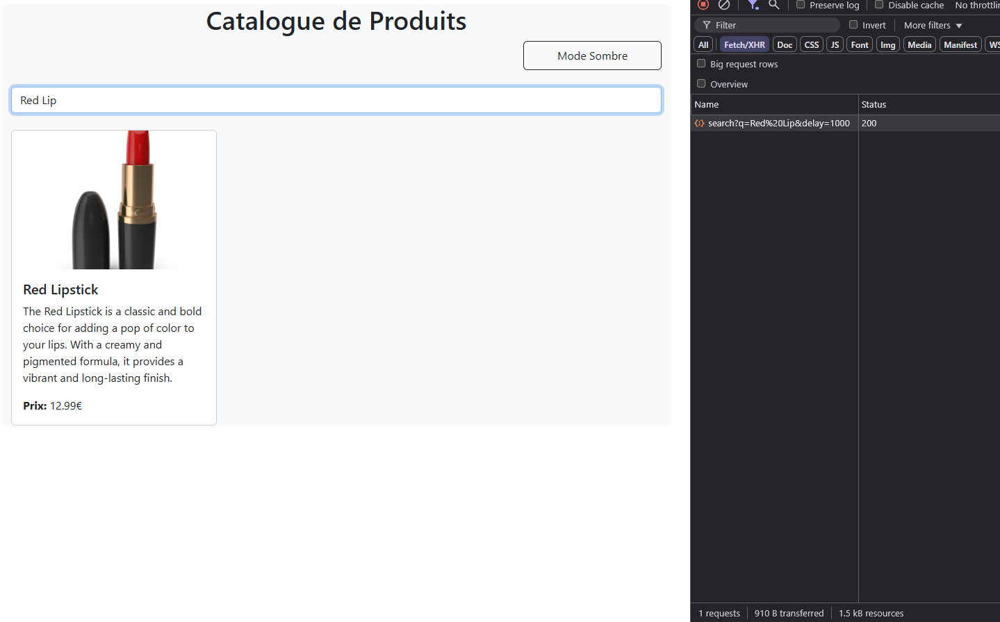
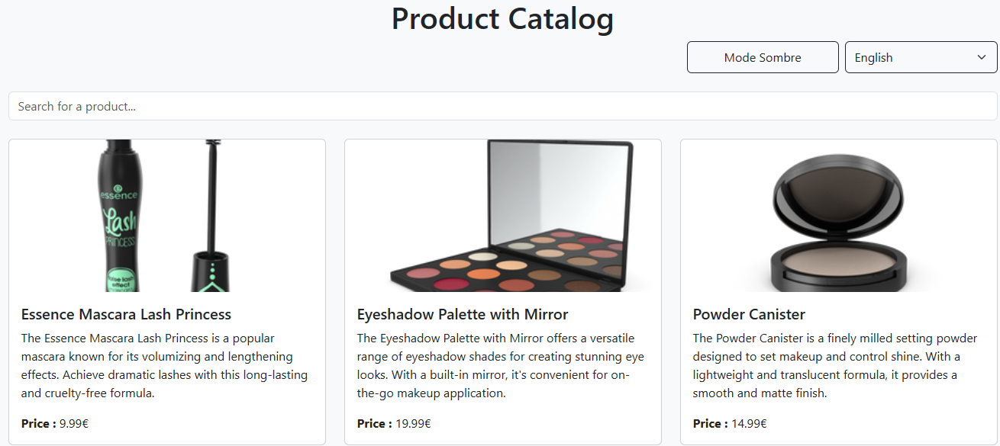
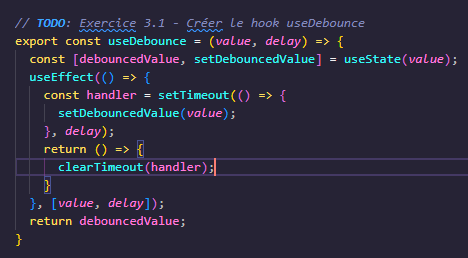
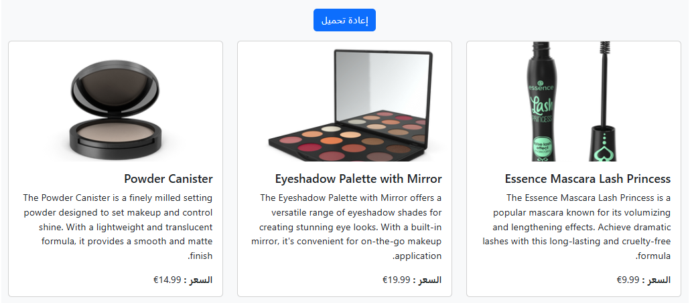

# TP React Hooks - Application de Gestion de Produits

Ce TP a pour objectif de mettre en pratique l'utilisation des Hooks React (useState, useEffect, useContext) ainsi que la création de Hooks personnalisés.

## Installation et configuration initiale

1. Cloner le dépôt :
```bash
git clone https://github.com/pr-daaif/tp-react-hooks.git
cd tp-react-hooks
```

2. Créer votre propre dépôt sur Github et changer le remote :
```bash
# Supprimer le remote origine
git remote remove origin

# Ajouter votre nouveau remote
git remote add origin https://github.com/[votre-username]/tp-react-hooks.git

# Premier push
git push -u origin main
```

3. Installer les dépendances :
```bash
npm install
```

4. Lancer l'application :
```bash
npm start
```

## Instructions pour le TP

Pour chaque exercice :
1. Lisez attentivement l'énoncé
2. Implémentez la solution
3. Testez votre implémentation (pensez à faire des copies d'écran)
4. Mettez à jour la section correspondante dans ce README avec :
   - Une brève explication de votre solution
   - Des captures d'écran montrant le fonctionnement
   - Les difficultés rencontrées et comment vous les avez résolues
5. Commitez vos changements avec un message descriptif

### Exercice 1 : État et Effets 
#### Objectif : Implémenter une recherche en temps réel

- [ ] 1.1 Modifier le composant ProductSearch pour utiliser la recherche
- [ ] 1.2 Implémenter le debounce sur la recherche
- [ ] 1.3 Documenter votre solution ici

_Votre réponse pour l'exercice 1 :_
```
C'est la première fois que j'ai travaillé avec le concept de debounce, et c'est une très belle expérience. Voici comment j'ai abordé la tâche :
   1. Premières difficultés rencontrées :
      - Au début, je n'avais pas de liaison entre les composants ProductSearch et ProductList. J'ai donc réfléchi à une solution et décidé d'ajouter un état dans le composant App pour établir cette liaison.
   2. Résolution de la première question (recherche simple) :
      - J'ai commencé par faire en sorte que la recherche fonctionne à chaque frappe sur le clavier. Je voyais que l'appel au serveur était effectué automatiquement à chaque caractère tapé, mais c'était un peu étrange, car cela envoyait trop de requêtes.
   3. Recherche sur le debounce :
      - Après avoir cherché sur Google, j'ai découvert que le debounce permet de gérer le délai entre chaque caractère tapé par l'utilisateur. Il attend un certain délai avant de lancer l'appel au serveur, ce qui évite d'envoyer des requêtes à chaque frappe de clavier.
   4. Solution finale :
      - J'ai intégré le debounce pour que l'appel au serveur ne se fasse qu'après un certain délai d'inactivité. Cela permet d'optimiser les requêtes et de ne pas les multiplier inutilement.
```
 ## Captures d'écran :
   | Avant la Recherche | Entrain de recherche | Après la recherche 1 | 
   |---|---|---|
   |  |  |  |

   | useDebounce Hook | Resultat d'exercice 1 |
   |---|---|
   |  |  | 
   
   <hr>
### Exercice 2 : Context et Internationalisation
#### Objectif : Gérer les préférences de langue

- [ ] 2.1 Créer le LanguageContext
- [ ] 2.2 Ajouter le sélecteur de langue
- [ ] 2.3 Documenter votre solution ici

_Votre réponse pour l'exercice 2 :_
```
 Voici comment j'ai abordé la tâche :
   1. Premières difficultés rencontrées :
      - Au début, je n'ai aucune idée de comment je peux traduire la liste des produits .
   2. Résolution d'exercice
      - J'ai d'abord créé un LanguageContext en utilisant la méthode createContext, puis j'ai ajouté un état pour gérer la langue, et enfin j'ai enveloppé l'application avec LanguageContext.Provider.
      - Ensuite, j'ai ajouté un composant LangueSelecteur pour gérer l'état de la langue et commencé à traduire chaque mot en fonction de la langue sélectionnée.
   3. Recherche sur L'internalisation :
      - J'ai déja utilisé Internalisation I18n en vue Framework.
   4. Solution finale :
      - J'ai répondu à tout l'exercice, sauf la liste des produits, car je n'avais aucune idée à ce sujet.
```

 ## Captures d'écran :
   | Français | English | العربية | 
   |---|---|---|
   |  |  |  |


### Exercice 3 : Hooks Personnalisés
#### Objectif : Créer des hooks réutilisables

- [ ] 3.1 Créer le hook useDebounce
- [ ] 3.2 Créer le hook useLocalStorage
- [ ] 3.3 Documenter votre solution ici

_Votre réponse pour l'exercice 3 :_
```
Voici comment j'ai abordé la tâche :
   1. Résolution d'exercice
      - J'ai déja utilisé useDebounce dans l'exercice 1
      - j'ai créé un hook personnalisé useLocalStorage qui permet de stocker et de récupérer des données depuis le localStorage du navigateur. Ce hook simplifie la gestion des données persistantes en utilisant les fonctionnalités natives de localStorage, tout en intégrant un état React pour mettre à          jour l'interface utilisateur en temps réel lorsque les données changent.
   3. Aucune Recherche
   4. Solution finale :
      - J'ai répondu à tout l'exercice .
```

 ## Captures d'écran :
   | useDebounce Hook | useLocalStorage HOOK |
   |---|---|
   |  |  |

### Exercice 4 : Gestion Asynchrone et Pagination
#### Objectif : Gérer le chargement et la pagination

- [ ] 4.1 Ajouter le bouton de rechargement
- [ ] 4.2 Implémenter la pagination
- [ ] 4.3 Documenter votre solution ici

_Votre réponse pour l'exercice 4 :_
```
  1. Résolution d'exercice
      - J'ai ajouté le bouton de rechargement pour permettre l'actualisation manuelle des produits.
      - J'ai intégré les états currentPage et totalPages pour gérer la pagination.
      - J'ai modifié la fonction fetchProducts en ajoutant un paramètre limit et en calculant totalPages en fonction de ce paramètre. J'ai également introduit une variable skip pour déterminer la page actuelle.
      - J'ai récupéré la fonction de rechargement et les états et fonctions de pagination pour les utiliser dans le composant.
   3. Aucune Recherche
   4. Solution finale :
      - J'ai répondu à tout l'exercice .
```

## Captures d'écran :
   | Première Page | Deuxième Page | Troisième page |
   |---|---|---|
   |  |  |  |

   | Avant de cliquer sur le bouton Recharger | Après avoir cliqué sur le bouton Recharger |
   |---|---|
   |  |  |
   
   | Implémentation Code  | Implémentation Code pour Bouton reload | Récupération  |
   |---|---|---|
   |  |  |  |
## Rendu

- Ajoutez l'URL de votre dépôt Github dans  **Classroom** et envoyer la réponse dès le démarage de votre projet.
- Les push doivent se faire au fûr et à mesure que vous avancez dans votre projet.
- Le README.md doit être à jour avec vos réponses et captures d'écran. 
- Chaques exercice doit faire l'objet d'au moins un commit avec un message mentionnant le numéro de l'exercice.
